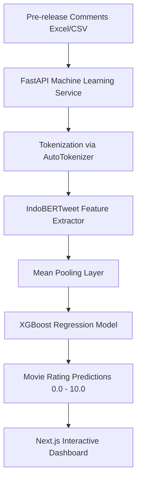

# IndoBERTweet & XGBoost-Based Movie Rating Predictor using Pre-Release Comments

This repository contains a full-stack web application developed as part of an undergraduate thesis (*Skripsi*) in Informatics Engineering. 

The system implements a hybrid machine learning pipeline using **IndoBERTweet** for Indonesian text embedding extraction and **XGBoost** for rating prediction regression. By processing user comments and discussions posted before a movie's official release (pre-release comments), the system predicts expected audience scores and provides a premium analytics dashboard to compare prediction variance with actual IMDb ratings.

---

## 🎯 Research Objectives
This project aims to:
* **Model Semantic Sentiments:** Extract rich contextual representations from Indonesian movie comments using a state-of-the-art pre-trained transformer model (**IndoBERTweet**).
* **Forecasting Movie Ratings:** Train and evaluate an **XGBoost** regression model to map text-based sentiment embeddings directly to average expected numerical ratings.
* **Analyze Early Sentiment Behavior:** Explore the correlation between pre-release social media sentiments and final movie reception.
* **Provide Academic Tooling:** Deliver a high-fidelity visual dashboard to support comparative evaluation, accuracy tracking, and thesis reporting.

---

## 📌 Key Features

### 🧠 IndoBERTweet Semantic Embedding
Utilizes `indolem/indobertweet-base-uncased` to generate 768-dimensional dense sentence embeddings from raw pre-release comments, fully capturing colloquial terms and Indonesian internet slang.

### 📈 XGBoost Rating Regression
Implements an optimized Gradient Boosting regressor trained on sentence embeddings to perform accurate numerical rating forecasts (Scale: 0.0 - 10.0).

### 🖥️ Next.js Premium Interactive Dashboard
A high-fidelity dashboard built with React 19, Tailwind CSS v4, and Lucide Icons, featuring:
* **Strict Validation Engine:** Blocks invalid file schemas, requiring both `title` and `comment` fields.
* **Responsive Data Previews:** Instant spreadsheet table rendering with smart line-wrap support for text.
* **Auto-Scroll Navigation:** Instantly scrolls down to analytics views the moment predictions complete.

### 📊 Drilldown & Dataset Comparison Analytics
* **Single Movie Drilldown:** Features radial circular progress gauges and accuracy insights displaying absolute error statistics.
* **Interactive ChartJS Canvas:** Side-by-side comparative datasets showing predicted averages next to IMDb ratings.
* **White-Canvas PNG Exporter:** Renders canvas plots on solid white backgrounds, solving transparent-layer image download issues.

---

## 🧠 Machine Learning Pipeline



---

## 🗺️ Data Representation
* **Nodes / Entities:** Movies and user comments.
* **Input Fields:**
  * `title` (Movie Title)
  * `comment` (Audience Comment Text)
  * `imdb_rating` / `actual_rating` (Optional IMDb Rating for comparison validation)
* **Dataset Format:** Microsoft Excel (`.xlsx`) or comma-separated values (`.csv`).

---

## 🚀 Getting Started

### Environment Dependencies
The project is built and optimized for cross-platform deployments:
* **Operating System:** Windows 10 / Windows 11
* **Programming Languages:** Python 3.9+ and Node.js 18+
* **ML Framework:** PyTorch & HuggingFace Transformers
* **Web Framework:** Next.js 15+ (App Router) & FastAPI (Asynchronous Python)

### Core Libraries
#### Backend (Python)
* `fastapi`
* `torch`
* `transformers`
* `xgboost`
* `joblib`
* `pandas`
* `numpy`

#### Dashboard (JavaScript/TS)
* `react` / `next`
* `tailwindcss`
* `chart.js`
* `lucide-react`
* `xlsx`

---

## 🛠️ Installation & Execution

### 1. Clone the Repository
```bash
git clone https://github.com/HezekiahIvandi/movie-predictor-dashboard.git
cd movie-predictor-dashboard
```

### 2. Set Up Machine Learning Backend
Navigate to the `backend` directory, create a virtual environment, and install ML dependencies:
```bash
cd backend
python -m venv venv
venv\Scripts\activate
pip install -r requirements.txt
```

Start the FastAPI ML development server:
```bash
python app.py
```
The backend API is now running locally at: **`http://127.0.0.1:8000`**

### 3. Set Up Next.js Frontend Dashboard
Navigate to the `dashboard` directory and install required node modules:
```bash
cd ../dashboard
npm install
```

Configure local environment variables. Create a `.env.local` file inside the dashboard folder:
```env
NEXT_PUBLIC_BACKEND_URL=http://127.0.0.1:8000
```

Start the dashboard dev server:
```bash
npm run dev
```
Open your browser and navigate to: **`http://localhost:3000`**

---

## 📊 Thesis Evaluation & Notebooks
Research notebooks, dataset files, and exploratory analyses conducted during the skripsi thesis phase are stored in the project root:
* **Jupyter Notebooks:**
  * `train_xgboost.ipynb` / `train_xgboost_v2.ipynb` / `train_xgboost_v3.ipynb` (Model training and optimization parameters).
  * `get-comments.ipynb` (Pre-release social media comment extraction tools).
* **Trained Models:**
  * `movie_rating_predictor_23_03_2026.pkl` (Serialized model bundle containing XGBoost weights).
* **Research Datasets:**
  * `data.xlsx` / `merged.xlsx` (Aggregated Indonesian comments data used for research evaluation).
